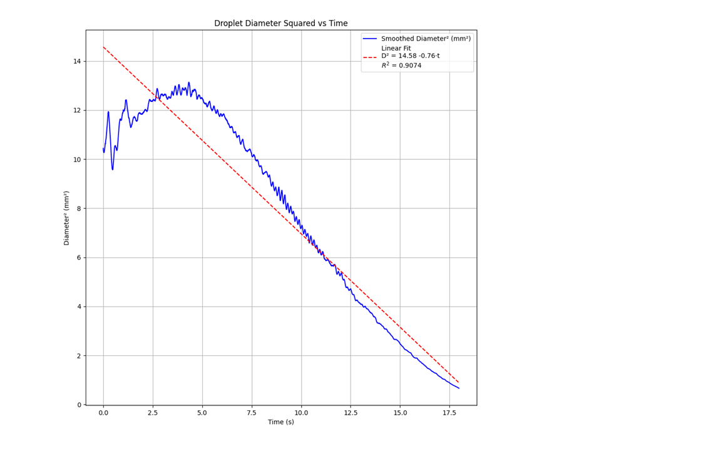

I have added the scripts for (i) Flame Length and blue to yellow flame region ratio calculator script (ii) plotter of droplet combustion experiment.

# Vision-Based Flame Structure Analysis

This repository contains a Python–OpenCV pipeline developed to **quantitatively analyze flame structure from combustion video data**. The objective of this code is to extract physically meaningful metrics from raw visual inputs using computer vision techniques.

The script processes flame videos captured through an optical window and computes:
- **Average flame length** in real-world units (cm) using pixel-to-physical calibration.
- **Yellow-to-blue flame area ratio**, serving as a proxy for soot formation and combustion regime identification.

The pipeline leverages **HSV color-space segmentation** to isolate flame regions, extracts dominant flame contours, and performs frame-wise aggregation to obtain statistically robust average metrics. These visual features can be correlated with operating parameters such as **fuel flow rate, equivalence ratio, and exit temperature** to study flame stability and combustion behavior.

This work demonstrates the use of computer vision for **structured analysis of dynamic physical phenomena**, with emphasis on:
- Video-based feature extraction
- Geometric measurement from images
- Color-based region classification
- Reproducible and scalable analysis pipelines

The methodology and implementation are directly applicable to broader domains involving **visual data interpretation, physical calibration, and quantitative analysis**, including vision-driven scientific computing and rendering pipelines.

# Droplet Combustion Analysis using Computer Vision

## Overview
This repository contains Python–OpenCV code developed to analyze a single suspended droplet combustion experiment using high-speed imaging. The objective is to extract the time-resolved droplet diameter from image data and experimentally verify the classical D²-law of droplet combustion.

## Purpose
The code processes high-speed camera images to:
- Detect the burning droplet from each frame
- Measure the droplet diameter in physical units
- Track the temporal evolution of the droplet size
- Plot diameter and diameter² versus time to determine the burning rate constant

## Experimental Details
- High-speed camera frame rate: **4000 fps**
- Total frames processed: ~18,000
- Image format: `.tif`
- Only the **upper 60%** of each image is analyzed to avoid solenoid shadow interference
- A known shadow line width of **0.2 mm** is used for spatial calibration

## Methodology
1. Convert images to grayscale
2. Crop the upper portion of each frame
3. Apply binary thresholding to isolate the droplet
4. Detect contours and select the largest contour as the droplet
5. Extract the **vertical droplet diameter**
6. Convert pixel measurements to millimeters using calibration
7. Compute diameter and diameter² as functions of time

## Theoretical Background
According to the D²-law of droplet combustion:
\[
D^2 = D_0^2 - k t
\]
where \(D\) is the droplet diameter, \(D_0\) is the initial diameter, and \(k\) is the burning rate constant.

## Outputs
- Diameter vs Time plot
- Diameter² vs Time plot
- Estimated burning rate constant from linear regression

Example plots generated from the analysis are included in this repository.

## Tools Used
- Python
- OpenCV
- NumPy
- Matplotlib

## Applications
- Spray and droplet combustion research
- Internal combustion engine modeling
- Gas turbine and burner design
- Fuel characterization
- Fire safety analysis

## Notes
This project focuses on droplet geometry evolution and does not include flame color or flame shape analysis.

# Square of Droplet Diameter vs Time

